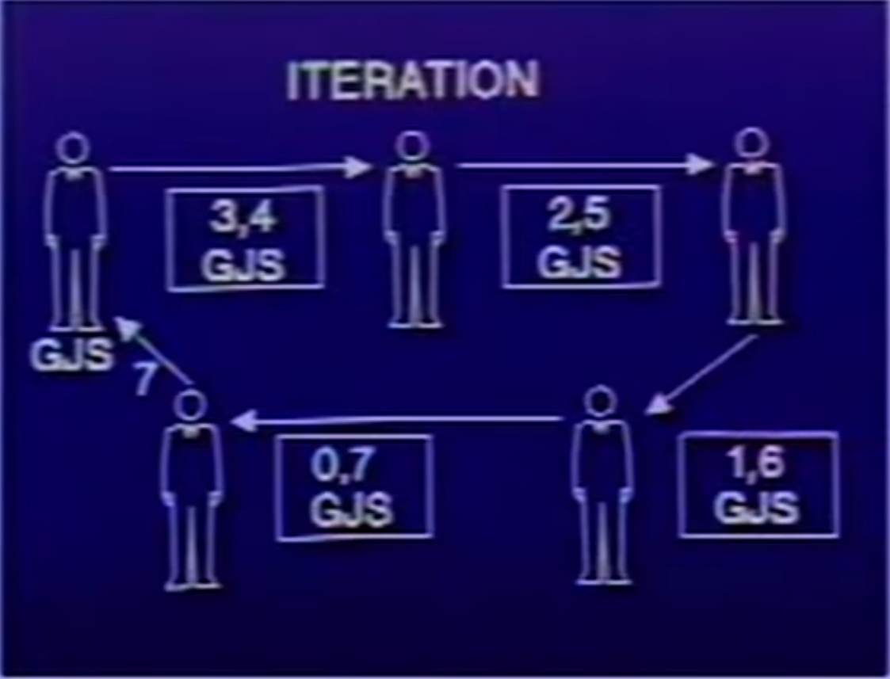
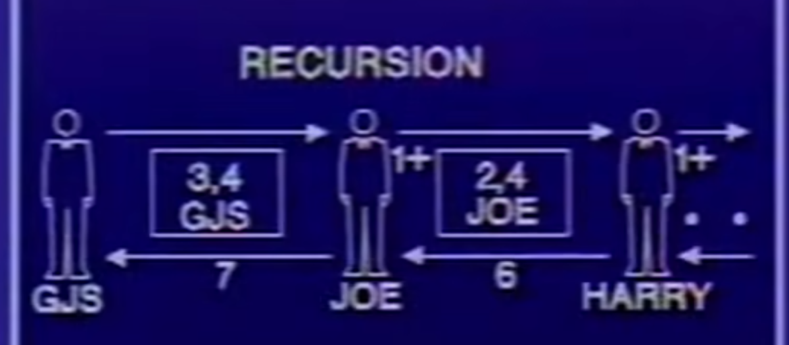

+++
date = '2026-02-14T22:41:53+08:00'
draft = false
title = 'MIT SICP 6.001 Lec1b: 计算过程 笔记'
comments = true
tags = ['计算机科学','学习','SICP']
+++

# 笔记

代码的计算是如何进行的？或者，过程和程序执行的原理是什么？

我们有个简单的模型：代换模型

但我们先看看我们前面所写的代码，我们可以找到以下几种表达式：

- 数字
- 符号
- Lambda表达式 [X]
- 定义表达式 [X]
- 条件表达式 [X]
- 组合式 

标 [x] 的为特殊形式

**代换规则（Substitution Rule）**

为求值一个应用（application）：  
1. 求值该操作符（operator），得到一个过程（procedure）；  
2. 求值各操作数（operands），得到各参数（arguments）；  
3. 将该过程应用于这些参数；  
4. 将该过程的主体（body）复制一份，并将其中的形式参数（formal parameters）替换为实际提供的参数；  
5. 对所得的新主体进行求值。

举例：
```lisp
(define (sq x) (* x x))

(sq 5) 

; 表达式会成为：
(* 5 5)

25
```

注意 * 也可以继续往下挖，但我们要学会忽略细节，因为计算机的抽象里，你怎么往下挖，都总会有更底层的东西，不去思考不必要的事情

代换模型并不是计算机的实际运作方法，但现在先这么想

对于一个if语句，会先求值谓词表达式，如果返回真，求值子句表达式，否则，求值选择表达式。

但，你写不一样的代码，最后运算中的“形状”也不一样

```lisp
(define (+ x y)
  (if (= x 0)
      y
      (+ (-1+ x) (1+ y))))
```

```lisp
; 按过程，得到
(+ 3 4)
(+ 2 5)
(+ 1 6)
(+ 0 7)
7
```

另一种写法中，

```lisp
(define (+ x y)
  (if (= x 0)
      y
      (1+ (+ (-1+ x) y))))
```

按过程得到

```lisp
(+ 3 4)
(1+ (+ 2 4))
(1+ (1+ (+ 1 4)))
(1+ (1+ (1+ (+ 0 4))))
(1+ (1+ (1+ 4)))
(1+ (1+ 5))
(1+ 6)
7
```

两种方法的形状明显不同，前者很直，后者头顶尖尖，先变大再变小，不马上求值而是堆起来之后再求

而这就引入了时间空间的概念，我们可以想象一个计算机，慢慢代换字符串，像这样：

```lisp
; 按过程，得到
(+ 3 4)
(+ 2 5)
(+ 1 6)
(+ 0 7)
7
```

计算的步骤与计算所用时间近似相等，竖着看作时间，横着看作空间，即计算需要保存的信息量

这个过程里数每大一点就多加一行，所以说他的时间为O(x)即正比于x，消耗的空间不变，所以空间为O(1)，这是迭代式的，线性迭代式

我们再看
```lisp
(+ 3 4)
(1+ (+ 2 4))
(1+ (1+ (+ 1 4)))
(1+ (1+ (1+ (+ 0 4))))
(1+ (1+ (1+ 4)))
(1+ (1+ 5))
(1+ 6)
7
```

其时间依旧为O(x)，正比于x
空间复杂度为O(x)

这是递归式的，是线性递归式





但区别是，迭代式可以用明确的变量保存计算过程中的状态，比如你运行到这给程序掐了：

```lisp
; 按过程，得到
(+ 3 4)
(+ 2 5)
```

还可以继续，所有状态都直接保存在参数里

但递归不行

```lisp
(+ 3 4)
(1+ (+ 2 4))
(1+ (1+ (+ 1 4)))
```

这样就不能回到原来计算(+ 3 4)本应是的那样了，未完成的1+操作隐式保存在计算机的深处【栈】

计算机里还隐藏了一会儿要推迟计算的内容

当然，还存在一些其他“形状“

比如兔群繁殖问题，那是指数级增长的,事实上就是斐波那契数

```lisp
(define (fib n)
  (if (< n 2)
      n
      (+ (fib (- n 1))
         (fib (- n 2)))))
```

我们能看出这是一个极其糟糕的算法，你求fib 4得算两次fib2，重复求了好几次已经求出的东西，需要求的值每加一，时间复杂度就乘上一个数，他的时间复杂度是指数级的 time = O(fib(n))

而space = O(n)，因为他需要记忆回去的路，消耗的空间取决于路径长度

回到代码，把他看作一种执行规则，在实际的运算过程中，你可以看出每一条树都是其的一次实际体现

编程就是在写一个通用规则，而这种规则会被应用于很多实际情况,其必须具有通用性，能帮你处理很多特定的情况

要学会递归的思考问题，我们可以看看汉诺塔：

”大梵天创造世界的时候做了三根金刚石柱子，在一根柱子上从下往上按照大小顺序摞着64片黄金圆盘。大梵天命令婆罗门把圆盘从下面开始按大小顺序重新摆放在另一根柱子上。并且规定，在小圆盘上不能放大圆盘，在三根柱子之间一次只能移动一个圆盘。“

要用算法计算，你会发现他同样是指数级的，移动的圆盘多一个，需要的时间就会大幅增长

练习：写出迭代式的斐波那契数算法